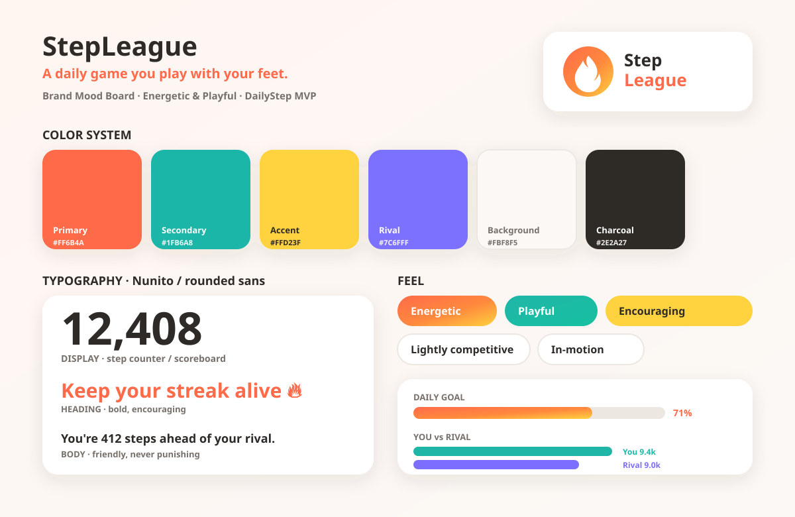
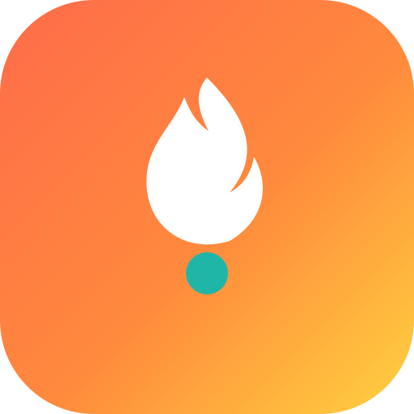

# StepLeague — Design Concept

**Status:** Draft v2
**Scope:** Visual direction for the MVP flagship World, **DailyStep**.
**Companion docs:** `docs/PRD.md` · live preview in `prototype/index.html` · code tokens in `app-mobile/lib/theme.ts`

> ℹ️ **On imagery:** The original plan was a Higgsfield-generated mood board + concept art. Higgsfield is paused (MCP approval issue), and this environment's egress policy also blocks stock-photo CDNs (Unsplash, Pexels, Pixabay, etc.). So the visuals below are **on-brand vector (SVG) assets generated locally** using the exact palette — plus the interactive `prototype/` for screen-level look-and-feel. Photographic mood imagery / Higgsfield concept art remains a **deferred loop-back item** (see §7).

---

## 1. Brand Personality

**Tone:** Energetic & playful — closer to Duolingo or Pokémon GO than to Strava or Apple Fitness.

- **Energetic** — motion, momentum, a sense of "go." Visuals should feel like they're mid-step, not static.
- **Playful** — rounded shapes, mascot/character energy, light celebratory moments (streak saves, challenge wins).
- **Encouraging, not punishing** — competitive elements (leaderboards, rivals) are framed as fun rivalry, never shame.
- **Slightly competitive** — an undercurrent of "can you beat your rival today?" without becoming hardcore/serious-athlete in feel.

**One-line mood statement:** *A daily game you play with your feet.*

---

## 2. Brand Mood Board

*Generated locally from the design tokens below — palette, type, mood keywords, and live component previews (daily-goal bar, you-vs-rival bars).*

### App Icon Concept

*Coral→yellow energy gradient with a white flame/forward-step mark and a teal "step" dot — reads at small sizes and ties the icon to the in-app streak flame.*

---

## 3. Design System

This is the **single source of truth** for visual tokens; `app-mobile/lib/theme.ts` mirrors these values exactly, and `prototype/style.css` hardcodes the same hexes.

### 3.1 Color tokens

| Token | Hex | Usage |
|---|---|---|
| `primary` | `#FF6B4A` | Coral/orange — primary CTAs, streak flame, daily-goal fill |
| `primaryDark` | `#E85A3A` | Pressed/active state of primary |
| `secondary` | `#1FB6A8` | Teal — progress, "You" in rival comparison, positive/ahead states |
| `secondaryDark` | `#178F84` | Pressed/active state of secondary |
| `accent` | `#FFD23F` | Sunny yellow — celebrations, badges, streak milestones |
| `rivalAccent` | `#7C6FFF` | Soft indigo — the AI **Rival** in head-to-head bars (see note below) |
| `background` | `#FBF8F5` | Soft off-white app background (never pure white) |
| `surface` | `#FFFFFF` | Card / sheet backgrounds |
| `textPrimary` | `#2E2A27` | Charcoal body/heading text (never pure black) |
| `textSecondary` | `#766F6A` | Muted labels, captions |
| `border` | `#EDE7E2` | Hairlines, empty progress tracks, card outlines |
| `danger` | `#E8543A` | "Behind"/negative states, destructive actions |

> **Rival color note:** DESIGN.md v1 only said "You in teal vs. a contrasting tone." We've assigned that contrasting tone a soft indigo (`#7C6FFF`) so the opponent is never confused with the primary CTA (coral), the user's own teal, or the yellow celebration color. This is a deliberate-but-swappable choice — change it in one place (`theme.ts` / this table) if a different rival color tests better.

### 3.2 Spacing scale (px)

| Token | xs | sm | md | lg | xl | xxl |
|---|---|---|---|---|---|---|
| Value | 4 | 8 | 16 | 24 | 32 | 48 |

### 3.3 Corner radii (px)

| Token | sm | md | lg | full |
|---|---|---|---|---|
| Value | 8 | 16 | 24 | 999 (pills/avatars) |

Rounded corners everywhere — the playful, friendly feel depends on it. Default cards use `lg` (24), buttons and chips use `full`.

### 3.4 Typography

- **Family:** Nunito (loaded via `@expo-google-fonts/nunito`); Poppins / SF Rounded are acceptable equivalents. Avoid condensed or technical-feeling faces.
- **Weights in use:** 400 (regular), 600 (semibold body), 700 (bold), 800 (extra-bold display).

| Token | Size (px) | Use |
|---|---|---|
| `display` | 48 | The step counter / scoreboard numerals — the hero number |
| `xl` | 28 | Screen titles, big stats |
| `lg` | 20 | Section headings, challenge titles |
| `md` | 16 | Body text |
| `sm` | 14 | Secondary labels |
| `xs` | 12 | Captions, pill text, rank deltas |

---

## 4. Key Screen Concept Art

Interactive, theme-accurate mockups of all five screens live in **`prototype/index.html`** — open it in any browser to see the look-and-feel (phone frames, real palette, mock data, clickable navigation). It maps 1:1 to the wireframes in `docs/PRD.md` §9 and to the Expo screens in `app-mobile/app/`.

| Screen | PRD ref | Prototype frame |
|---|---|---|
| Onboarding & permissions | §9.1 | `#onboarding` |
| Home / Daily Dashboard | §9.2 | `#home` |
| Friends Leaderboard | §9.3 | `#leaderboard` |
| AI Rival Comparison | §9.4 | `#rival` |
| Streak & Challenge | §9.5 | `#streaks` |

---

## 5. Key Screens — Written Descriptions

(Summarized from PRD §9 for design reference; the PRD is the source of truth for functional requirements.)

| Screen | Visual priority | Key visual elements |
|---|---|---|
| Onboarding | Vision-first, low friction | Full-bleed hero panel, single permission CTA, skippable invite step |
| Home/Dashboard | Step count + streak dominate | `display` numerals, flame icon, daily-goal bar, today's rival-pace sliver |
| Friends Leaderboard | Rank clarity | Avatar list, rank-change arrows, weekly reset countdown pill, invite CTA |
| AI Rival Comparison | Head-to-head bars | "You" (teal) vs. "Rival" (indigo) bars, gap callout line |
| Streak/Challenge | Progress + history | Streak calendar strip, active challenge progress, joinable challenge cards |

---

## 6. Visual Do / Don't

- **Do** keep one clear primary action (coral) per screen; **don't** stack multiple coral CTAs competing for attention.
- **Do** use yellow only for reward/celebration moments so it stays meaningful; **don't** use it for routine UI.
- **Do** frame competition positively ("You're 412 steps ahead"); **don't** use red/shame framing for being behind.
- **Do** keep big numbers big — the step count is the scoreboard and the emotional core of the screen.

---

## 7. Deferred / Loop-Back Items

1. **Photographic mood imagery** — energetic movement / city-walk / celebration photos to sit alongside the vector board, once a reachable image source or Higgsfield is available.
2. **Higgsfield concept art** — the original mood board + character/mascot concepts (the AI Rival will eventually want a face/personality).
3. **Hi-fi mockups** — feed these assets + the prototype into a dedicated UI design tool for pixel-accurate, production-ready screens.
